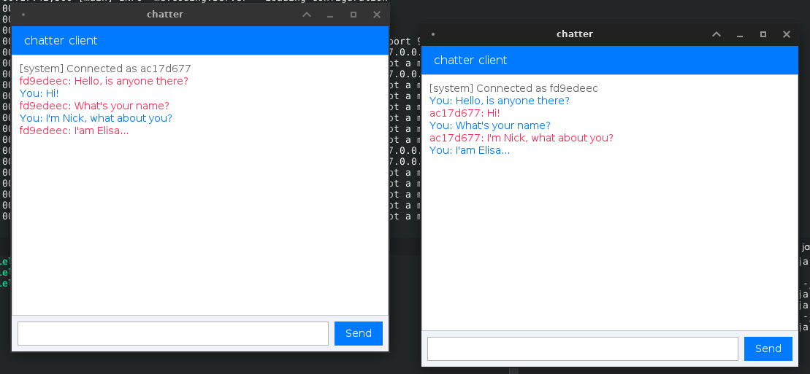

# chatter

chatter is a simple client-server application that uses bare TCP socket programming to create a minimal chat system in Java. Use Makefile to generate jar files of the server and the client. By default, the server runs on port 9090 and localhost. The client connects according to the previous configuration.

